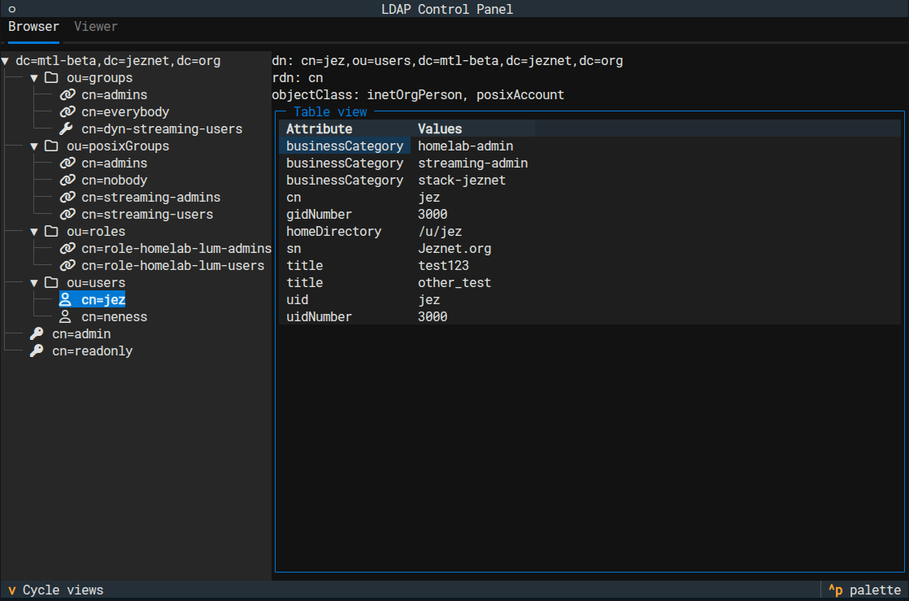

# LDAP Control Panel

A modern Python application for LDAP directory management with both terminal and web interfaces.

## Features

- **Multi-Interface**: Terminal UI (TUI) and web interface
- **LDAP Browser**: Navigate and explore LDAP directories with tree view
- **LDAP Viewer**: Custom views for users, groups, and organizational units
- **Real-time Navigation**: Expand/collapse tree nodes, view entry details
- **Multiple Views**: Table and JSON formats for data display
- **Configurable**: YAML-based configuration for LDAP connections and display options




## Quick Start

There are two main installation way:
- Via docker: Better for self hosting or quickly try the app easily.
- Via python: Better for local installation or development.

### Quick Start - Docker

```bash
# Run with Docker
docker run --rm -ti \
  -e "LDAPCP__AUTHLDAP__uri=ldap://your-ldap-server:389" \
  -e "LDAPCP__AUTHLDAP__bind_dn=cn=admin,dc=example,dc=com" \
  -e "LDAPCP__AUTHLDAP__bind_pass=your-password" \
  mrjk78/ldap-control-panel:main ldapcp-tui

# Or serve web interface
docker run --rm -ti \
  -e "LDAPCP__AUTHLDAP__uri=ldap://your-ldap-server:389" \
  -e "LDAPCP__AUTHLDAP__bind_dn=cn=admin,dc=example,dc=com" \
  -e "LDAPCP__AUTHLDAP__bind_pass=your-password" \
  -p 8000:8000 \
  mrjk78/ldap-control-panel:main ldapcp-serve --host 0.0.0.0 --port 8000
```

#### Quick Start - Docker Compose

```bash
# Create docker-compose.yml
cat > docker-compose.yml << EOF
version: '3.8'
services:
  lcp:
    image: mrjk78/ldap-control-panel:main
    environment:
      - LDAPCP__AUTHLDAP__uri=ldap://your-ldap-server:389
      - LDAPCP__AUTHLDAP__bind_dn=cn=admin,dc=example,dc=com
      - LDAPCP__AUTHLDAP__bind_pass=your-password
    ports:
      - "8000:8000"
EOF

# Run with Docker Compose
docker compose up
```

### Quick Start - Local

#### Installation

```bash
# Using Poetry (recommended)
poetry install

# Or using pip
pip install ldap-idp
```

#### Terminal Interface

```bash
# Run the main TUI application
ldapcp-tui

# Or directly with Python
python -m ldap_idp.main
```

#### Web Interface

```bash
# Serve the web interface
ldapcp-serve --host 0.0.0.0 --port 8000

# Or with debug mode
ldapcp-serve --debug
```

## Configuration

Edit `ldap_idp/settings.yaml` to configure:

- LDAP connection parameters
- Display preferences
- Custom views and filters
- Attribute visibility settings

```yaml
authldap:
  uri: "ldap://localhost:389"
  bind_dn: "cn=admin,dc=example,dc=com"
  bind_pass: "admin"

browser:
  default_view: table
  auto_expand: true
  display_mode: full
```

## Applications

### Browser
- Navigate LDAP directory structure
- View entry attributes in table/JSON format
- Expand/collapse tree nodes
- Search and filter entries

### Viewer  
- Custom views for users, groups, and OUs
- Predefined filters and attribute sets
- Profile-based data display
- Quick access to common LDAP operations

## Keyboard Shortcuts

- `q` or `Ctrl+C`: Quit application
- `Tab`: Switch between panes
- `v`: Cycle through view modes
- `Enter`/`Space`: Expand/collapse tree nodes
- Arrow keys: Navigate tree and forms

## Development

```bash
# Install development dependencies
poetry install --with dev

# Run with development tools
poetry run textual dev ldap_idp.main

# Run tests
poetry run pytest
```

## Architecture

- **Modular Design**: Separate apps for different LDAP operations
- **Textual Framework**: Modern terminal UI with responsive design
- **Async Support**: Non-blocking LDAP operations
- **Configuration Driven**: YAML-based settings for flexibility

## License

GPLv3 - See LICENSE file for details. 
